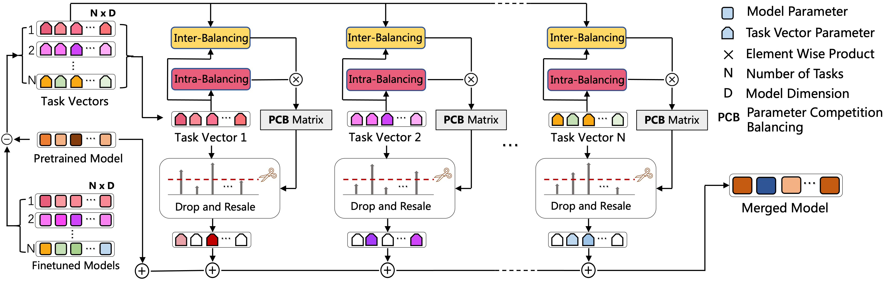

# Parameter Competition Balancing for Model Merging (PCB-Merging)([NeurIPS 2024](https://neurips.cc/))

This is the source code to reproduce the experiments for "[Parameter Competition Balancing for Model Merging](https://arxiv.org/pdf/2410.02396)" by Guodong Du, Junlin Lee, Jing Li, Runhua Jiang, Shuyang Yu, Yifei Guo, Hanting Liu, Sim Kuan Goh, Ho-Kin Tang.

our key contributions include:
1) We re-examine existing model merging methods, highlighting the critical role of parameter competition awareness;
2) We introduce a novel approach called **PCB-Merging**, which effectively adjusts parameter coefficients through balancing parameter competition;
3) Our proposed method stabilizes and enhances model merging performance across various application scenarios without additional training.




#### Source Code
We release the source code for cross-task merging experiments, including `nlp_src` and `vision_src`. More code will be released as soon as possible.
The details of our method are shown in the file `pcb-merging.py`. Additionally, you can check the application in different scenarios with evolutionary strategies in `pcb_ES.py` (found in the `vision_source_code` directory) or `merging.py` (in the `nlp_source_code` directory). You can obtain the model population by executing `run_finetuning.sh` and try different merging methods using `run_merging.sh`.

#### Key Steps in Our Proposed PCB-Merging
We release an implementation of the key steps in our proposed method, including intra-balancing, inter-balancing, drop and rescale, as shown in `pcb-merging.py`. In addition, we include the implementation of evolutionary strategies.

## Setup

1. Create a virtual environment and activate it.
```
python3 -m venv env
source env/bin/activate
```
2. Install dependencies
```
python -m pip install -r requirements.txt -f https://download.pytorch.org/whl/cu113/torch_stable.html
```

3. Download Story Cloze Dataset and update its path in data/dataset_readers.py StoryClozeReader class.

4. Set the path to where finetuned models are stored in utils/merge_utils.py

We download the released the [IA3 checkpoints](https://drive.google.com/drive/folders/1V2-SLOgK248TQBMP2i_cEdQnxB2jM2E1?usp=sharing) from [TIES_Merging](https://github.com/prateeky2806/ties-merging)

# Reference
Please cite our paper if you use our models in your works:

```bibtex
```
@misc{du2024pcb-merging,
      title={Parameter Competition Balancing for Model Merging}, 
      author={Guodong Du and Junlin Lee and Jing Li and Runhua Jiang and Yifei Guo and Shuyang Yu and Hanting Liu and Sim Kuan Goh and Ho-Kin Tang and Daojing He and Min Zhang},
      year={2024},
      eprint={2410.02396},
      archivePrefix={arXiv},
      primaryClass={cs.CV},
      url={https://arxiv.org/abs/2410.02396}, 
}
```
